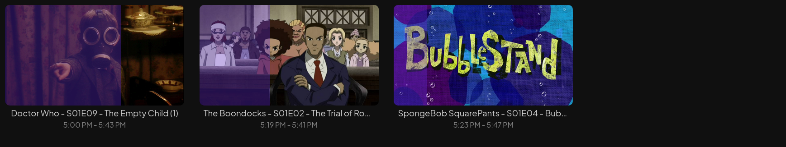

# Jellyfin Virtual TV

Virtual live TV channels from your Jellyfin media library. Turn your media collection into a channel-surfing experience with a full EPG guide, M3U tuner support, and automatic scheduling.



## Features

- **Virtual Channels** — Create themed channels (Cartoons, Sci-Fi, Action, etc.) from your existing Jellyfin libraries
- **EPG Guide** — Full XMLTV electronic program guide with thumbnails, integrated directly into Jellyfin's Live TV
- **M3U Tuner** — Standard IPTV tuner format, works natively with Jellyfin Live TV
- **Smart Filtering** — Filter content by library, genre, tags, item type (Movies/Episodes), or title match
- **24-Hour Scheduling** — Deterministic daily schedules with random or sequential shuffle modes
- **Stream Proxy** — Proxies streams through to Jellyfin so clients see real "live TV" playback
- **Channel Management UI** — React-based web interface for creating and managing channels
- **Docker Ready** — Multi-stage Docker build, deploys easily with Coolify or any Docker host

## Tech Stack

| Layer | Technology |
|-------|-----------|
| Server | Express.js (Node 22) |
| Frontend | React 18 + Vite |
| Database | SQLite (better-sqlite3) |
| Language | TypeScript (strict) |
| Container | Docker (multi-stage build) |

## Quick Start

### Prerequisites

- A running [Jellyfin](https://jellyfin.org/) server
- A Jellyfin API key (Dashboard > API Keys)
- Docker and Docker Compose (for deployment)

### 1. Clone and configure

```bash
git clone https://github.com/lolimmlost/jellyfin-virtual-tv.git
cd jellyfin-virtual-tv
cp .env.example .env
```

Edit `.env` with your Jellyfin details:

```env
JELLYFIN_URL=http://your-jellyfin-server:8096
JELLYFIN_API_KEY=your-api-key-here
PORT=3000
BASE_URL=http://your-host:3336  # External URL clients will use for streams
```

### 2. Run with Docker Compose

```bash
docker compose up -d
```

The app will be available at `http://your-host:3336`.

### 3. Add to Jellyfin

In Jellyfin, go to **Dashboard > Live TV**:

**Add Tuner:**
- Type: M3U Tuner
- URL: `http://your-host:3336/iptv/channels.m3u`

**Add Guide Provider:**
- Type: XMLTV
- URL: `http://your-host:3336/iptv/epg.xml`

### 4. Create channels

Open the web UI at `http://your-host:3336` and create your channels. Each channel can filter content by:

- **Libraries** — Pick which Jellyfin libraries to pull from
- **Item Types** — Movies, Episodes, or both
- **Genres** — Action, Comedy, Sci-Fi, etc.
- **Tags** — Any Jellyfin tags you've set up
- **Title Match** — Search by series/movie name (e.g., "SpongeBob")

After creating channels, refresh the guide data in Jellyfin to see them in the Live TV guide.

## Development

```bash
npm install
npm run dev
```

This starts both the Express API server (port 3000) and the Vite dev server (port 5173) with hot reload. The Vite dev server proxies `/api` and `/iptv` requests to Express.

## API Endpoints

### IPTV

| Endpoint | Description |
|----------|-------------|
| `GET /iptv/channels.m3u` | M3U playlist for Jellyfin tuner |
| `GET /iptv/epg.xml` | XMLTV guide for Jellyfin |
| `GET /iptv/stream/:channelId` | Live stream proxy |
| `GET /iptv/schedule/:channelId` | Full schedule for a channel |
| `GET /iptv/now/:channelId` | What's currently playing |

### Channels

| Endpoint | Description |
|----------|-------------|
| `GET /api/channels` | List all channels |
| `POST /api/channels` | Create a channel |
| `PUT /api/channels/:id` | Update a channel |
| `DELETE /api/channels/:id` | Delete a channel |

### Jellyfin

| Endpoint | Description |
|----------|-------------|
| `GET /api/jellyfin/status` | Connection status |
| `GET /api/jellyfin/libraries` | List libraries |
| `GET /api/jellyfin/items` | Query items |

## Environment Variables

| Variable | Required | Default | Description |
|----------|----------|---------|-------------|
| `JELLYFIN_URL` | Yes | — | Your Jellyfin server URL |
| `JELLYFIN_API_KEY` | Yes | — | Jellyfin API key |
| `PORT` | No | `3000` | Server port |
| `BASE_URL` | No | Auto-detected | External URL for stream links in M3U |
| `DB_PATH` | No | `./data/virtual-tv.db` | SQLite database path |
| `NODE_ENV` | No | — | Set to `production` for static file serving |

## How It Works

1. **Channels** are configured with content filters (genre, library, title match, etc.)
2. The **schedule engine** fetches matching items from Jellyfin and builds a deterministic 24-hour playlist per channel, regenerated hourly
3. The **M3U endpoint** lists channels for Jellyfin's IPTV tuner
4. The **XMLTV endpoint** provides the full programme guide with titles and thumbnails
5. When a client tunes in, the **stream proxy** calculates the current position in the schedule and streams the correct media file from Jellyfin

## Project Structure

```
src/
  server/
    index.ts              # Express entry point
    db.ts                 # SQLite database
    schedule.ts           # 24h schedule engine
    jellyfin-client.ts    # Jellyfin API client
    routes/
      iptv.ts             # M3U, XMLTV, streaming
      channels.ts         # Channel CRUD
      jellyfin.ts         # Jellyfin proxy
  client/
    App.tsx               # React UI
    main.tsx              # Entry point
  shared/
    types.ts              # Shared TypeScript types
```

## License

MIT
