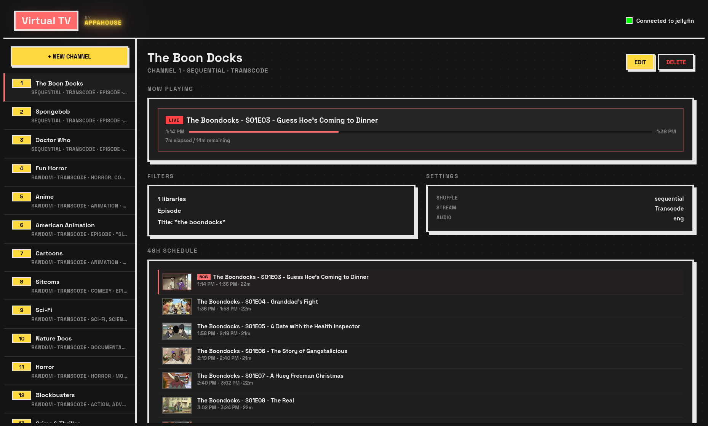
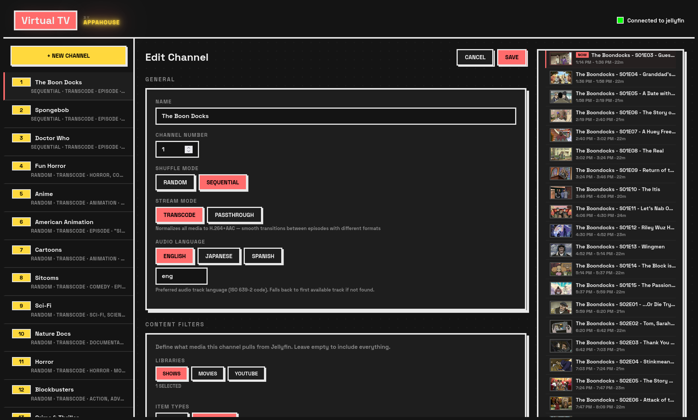
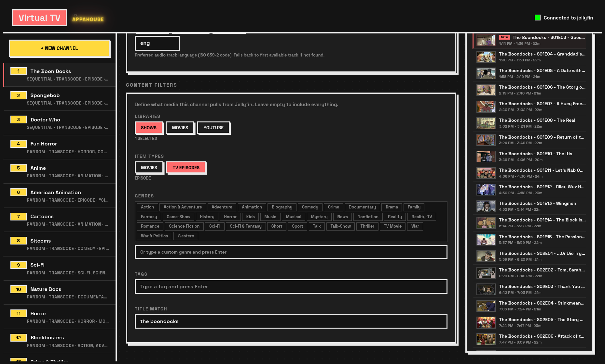
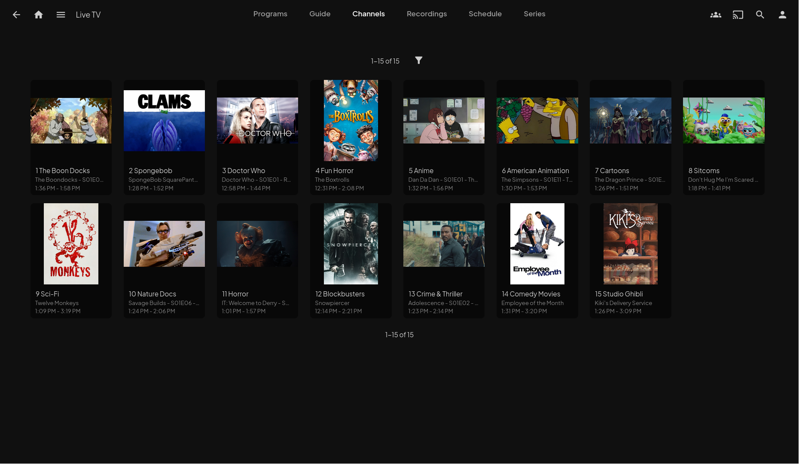
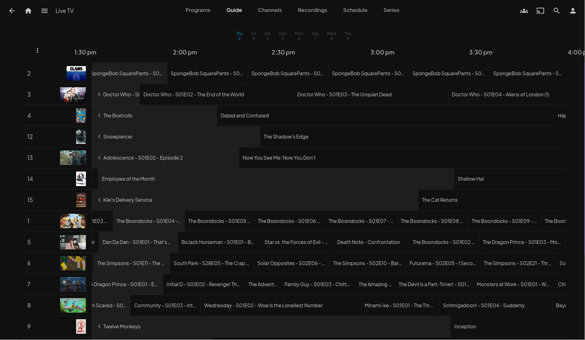

# Jellyfin Virtual TV

Virtual live TV channels from your Jellyfin media library. Turn your media collection into a channel-surfing experience with a full EPG guide, M3U tuner support, and automatic scheduling.


## Features

- **Virtual Channels** — Create themed channels (Cartoons, Sci-Fi, Action, etc.) from your existing Jellyfin libraries
- **EPG Guide** — Full XMLTV electronic program guide with thumbnails, integrated directly into Jellyfin's Live TV
- **M3U Tuner** — Standard IPTV tuner format, works natively with Jellyfin Live TV
- **Smart Filtering** — Filter content by library, genre, tags, item type (Movies/Episodes), or comma-separated title match
- **Genre Picker** — Autocomplete genre selection pulled directly from your Jellyfin library, with custom genre support
- **48-Hour Scheduling** — Deterministic schedules covering all timezones, with random or sequential shuffle modes, regenerated hourly
- **GPU Transcoding** — Offloads HEVC/H264 transcoding to Jellyfin's GPU for seamless mixed-codec playback
- **Audio Language** — Per-channel preferred audio track (English, Japanese, Spanish, or any ISO 639-2 code)
- **Stream Modes** — Transcode (H.264+AAC, handles mixed codecs) or Passthrough (original codecs, lower CPU)
- **Channel Management UI** — React-based web interface with now-playing status, live 48h schedule preview, and real-time editing
- **Docker Ready** — Multi-stage Docker build, deploys easily with Coolify or any Docker host

## Screenshots

### Channel Management
Create and manage channels with real-time schedule preview, now-playing status, and content filters.


*Channel detail view with now-playing, filters, settings, and 48h schedule*


*Edit channel settings with live schedule preview sidebar*


*Content filters with genre picker pulled from your Jellyfin library*

### Jellyfin Integration
Channels appear natively in Jellyfin's Live TV with full EPG data, thumbnails, and auto-populated channel logos.


*All 15 channels with poster art on Jellyfin's Channels page*


*"On Now" view in Jellyfin showing what's playing across all channels*


*Full EPG grid view in Jellyfin's Live TV guide with channel logos*

## Tech Stack

| Layer | Technology |
|-------|-----------|
| Server | Express.js (Node 22) |
| Frontend | React 18 + Vite |
| Database | SQLite (better-sqlite3) |
| Language | TypeScript (strict) |
| Container | Docker (multi-stage build) |

## Quick Start

### Prerequisites

- A running [Jellyfin](https://jellyfin.org/) server
- A Jellyfin API key (Dashboard > API Keys)
- Docker and Docker Compose (for deployment)

### 1. Clone and configure

```bash
git clone https://github.com/lolimmlost/jellyfin-virtual-tv.git
cd jellyfin-virtual-tv
cp .env.example .env
```

Edit `.env` with your Jellyfin details:

```env
JELLYFIN_URL=http://your-jellyfin-server:8096
JELLYFIN_API_KEY=your-api-key-here
PORT=3000
BASE_URL=http://your-host:3336  # External URL clients will use for streams
```

### 2. Run with Docker Compose

```bash
docker compose up -d
```

The app will be available at `http://your-host:3336`.

### 3. Add to Jellyfin

In Jellyfin, go to **Dashboard > Live TV**:

**Add Tuner:**
- Type: M3U Tuner
- URL: `http://your-host:3336/iptv/channels.m3u`

**Add Guide Provider:**
- Type: XMLTV
- URL: `http://your-host:3336/iptv/epg.xml`

### 4. Create channels

Open the web UI at `http://your-host:3336` and create your channels. Each channel can be configured with:

**Content Filters:**
- **Libraries** — Pick which Jellyfin libraries to pull from
- **Item Types** — Movies, Episodes, or both
- **Genres** — Select from your Jellyfin library's genres via the genre picker, or type custom genres
- **Tags** — Any Jellyfin tags you've set up
- **Title Match** — Comma-separated series/movie names (e.g., "SpongeBob, Simpsons, Futurama")

**Playback Settings:**
- **Shuffle Mode** — Random (different order daily) or Sequential (plays in series order)
- **Stream Mode** — Transcode (normalizes to H.264+AAC for mixed-codec libraries) or Passthrough (original codecs)
- **Audio Language** — Preferred audio track language per channel (e.g., Japanese for anime channels)

After creating channels, refresh the guide data in Jellyfin to see them in the Live TV guide.

## Development

```bash
npm install
npm run dev
```

This starts both the Express API server (port 3000) and the Vite dev server (port 5173) with hot reload. The Vite dev server proxies `/api` and `/iptv` requests to Express.

## API Endpoints

### IPTV

| Endpoint | Description |
|----------|-------------|
| `GET /iptv/channels.m3u` | M3U playlist for Jellyfin tuner |
| `GET /iptv/epg.xml` | XMLTV guide for Jellyfin |
| `GET /iptv/stream/:channelId` | Live stream proxy |
| `GET /iptv/schedule/:channelId` | Full schedule for a channel |
| `GET /iptv/now/:channelId` | What's currently playing |

### Channels

| Endpoint | Description |
|----------|-------------|
| `GET /api/channels` | List all channels |
| `POST /api/channels` | Create a channel |
| `PUT /api/channels/:id` | Update a channel |
| `DELETE /api/channels/:id` | Delete a channel |

### Jellyfin

| Endpoint | Description |
|----------|-------------|
| `GET /api/jellyfin/status` | Connection status |
| `GET /api/jellyfin/libraries` | List libraries |
| `GET /api/jellyfin/genres` | List all genres |
| `GET /api/jellyfin/items` | Query items |

## Environment Variables

| Variable | Required | Default | Description |
|----------|----------|---------|-------------|
| `JELLYFIN_URL` | Yes | — | Your Jellyfin server URL |
| `JELLYFIN_API_KEY` | Yes | — | Jellyfin API key |
| `PORT` | No | `3000` | Server port |
| `BASE_URL` | No | Auto-detected | External URL for stream links in M3U |
| `DB_PATH` | No | `./data/virtual-tv.db` | SQLite database path |
| `NODE_ENV` | No | — | Set to `production` for static file serving |

## How It Works

1. **Channels** are configured with content filters (genre, library, title match, etc.) and playback settings (shuffle mode, stream mode, audio language)
2. The **schedule engine** fetches matching items from Jellyfin and builds a deterministic 48-hour playlist per channel, regenerated hourly
3. The **M3U endpoint** lists channels for Jellyfin's IPTV tuner
4. The **XMLTV endpoint** provides the full programme guide with titles and thumbnails
5. When a client tunes in, the **stream proxy** requests transcoded H.264+AAC from Jellyfin's GPU (or passthrough if configured), chains episodes via ffmpeg concat demuxer, and streams continuous MPEG-TS to the client

## Project Structure

```
src/
  server/
    index.ts              # Express entry point
    db.ts                 # SQLite database
    schedule.ts           # 24h schedule engine
    jellyfin-client.ts    # Jellyfin API client
    routes/
      iptv.ts             # M3U, XMLTV, streaming
      channels.ts         # Channel CRUD
      jellyfin.ts         # Jellyfin proxy
  client/
    App.tsx               # React UI
    main.tsx              # Entry point
  shared/
    types.ts              # Shared TypeScript types
```

## Troubleshooting

### Stale EPG / Guide shows wrong content

Jellyfin caches EPG data aggressively. After updating channels or changing schedule logic, the guide may still show old data even after restarting Jellyfin.

**Method 1: API refresh (try first)**

Trigger the "Refresh Guide" scheduled task via the Jellyfin API:

```bash
curl -X POST "http://your-jellyfin:8096/ScheduledTasks/Running/TASK_ID" \
  -H 'Authorization: MediaBrowser Token="YOUR_API_KEY"'
```

To find the task ID:
```bash
curl "http://your-jellyfin:8096/ScheduledTasks" \
  -H 'Authorization: MediaBrowser Token="YOUR_API_KEY"' | grep -i "refresh guide"
```

**Method 2: Delete cached EPG files**

If the API refresh isn't enough, clear the cache files directly:

1. Stop Jellyfin
2. Delete the EPG cache files from Jellyfin's config directory:
   ```bash
   rm <jellyfin-config>/cache/*_channels
   rm <jellyfin-config>/cache/xmltv/*.xml
   rm -rf <jellyfin-config>/cache/channels/*
   ```
3. Start Jellyfin
4. Run "Refresh Guide" from Dashboard > Scheduled Tasks

### EPG and stream showing different content

This happens when Jellyfin's cached EPG is from a previous schedule generation. Both the EPG (`/iptv/epg.xml`) and stream (`/iptv/stream/:id`) use the same schedule engine — if they disagree, the issue is always a stale Jellyfin cache. Clear it using the methods above.

### No content on a channel

- Check that the channel's genre filters match what Jellyfin actually has. Genre names can differ between libraries (e.g., TV shows use "Sci-Fi" while movies use "Science Fiction").
- Use the items endpoint to test: `GET /api/jellyfin/items?genres=YourGenre&libraryId=yourLibId`
- For anime, use "Animation" — Jellyfin has no "Anime" genre.
- Multiple genres use OR logic (matches any), not AND.

### Video freezes at episode boundaries

Set the channel's stream mode to **Transcode** (the default). Passthrough (`copy`) mode requires all files in the channel to have identical codecs, resolution, and audio format. Mixed-codec libraries need transcoding for seamless playback.

### HEVC content fails to play (FFmpeg exit code 234)

Jellyfin caches codec probe results per channel. If you changed the stream pipeline (e.g., enabled GPU transcoding), Jellyfin may still have stale HEVC probe data cached. Signs: probe takes <1ms instead of 3-4 seconds, codec shows "hevc" despite transcoding to H264.

**Fix:** The app includes a cache-busting version parameter (`?f=2`) in M3U stream URLs. If you hit this issue, bump the version in `src/server/routes/iptv.ts`, redeploy, and refresh the M3U tuner in Jellyfin Dashboard > Live TV.

### Wrong audio language

Each channel has an **Audio Language** setting (default: English). For anime channels, set this to Japanese (`jpn`). The setting uses ISO 639-2 language codes. If the preferred language isn't found, Jellyfin falls back to the first available audio track.

## License

MIT
